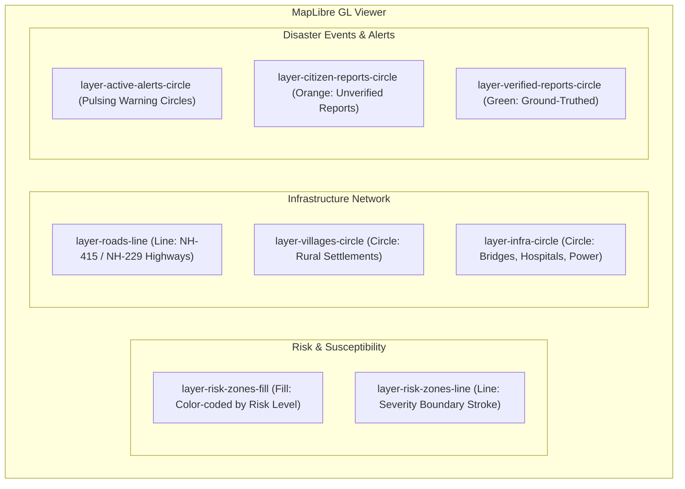

# Frontend Application Description: NER-LEWS
## AI-Based Early Warning and Smart Monitoring System for North-East Region (Frontend Command Center)

> **SIH 2026 Initiative**: Comprehensive Technical Documentation, UI/UX Architecture, Component Breakdown, and Library Analysis for the Frontend Platform.

---

## 1. Executive Summary & Purpose

The **NER-LEWS Frontend** is a modern, high-performance, single-page geospatial command center designed specifically for monitoring landslide hazards, environmental telemetry, and disaster response operations across the rugged terrain of North-East India (with focal deployment across **Arunachal Pradesh**).

Built for District Disaster Management Officers (DDMO), Emergency Operation Centre (EOC) personnel, and state administrators, this frontend application transforms complex spatial, satellite, and environmental datasets into intuitive, real-time visual interfaces.

### Core Objectives of the Frontend:
- **Interactive Spatial Situational Awareness**: Deliver a 60 FPS GPU-accelerated WebGL map interface displaying dynamic landslide risk zones, critical highway corridors (e.g., NH-415, Trans-Arunachal Highway NH-229), village settlements, and critical infrastructure.
- **Real-Time Warning Prioritization**: Present active landslide threats through a live, floating Warning Priority Queue sorted from P1 Critical to P4 Low.
- **Field Ingestion & Verification Workflows**: Provide ground verification management tools allowing officers to audit crowdsourced citizen reports and instantly project verified incident markers onto the GIS hazard layer.
- **Predictive Decision Support**: Deliver multi-factor analytical dashboards (satellite rainfall accumulation, slope gradients, soil saturation, and historical disaster trends).
- **Resilient, Zero-Downtime Design**: Feature a decoupled client architecture with built-in client-side mock datasets and fail-safe fallback handling, ensuring the application remains fully functional during network disruptions or standalone field demonstrations.

---

## 2. Technology Stack & Library Selection Rationale

The frontend is built using modern web standards, prioritizing high rendering speeds, minimal bundle overhead, declarative reactive state, and open-source geospatial graphics.

```
┌────────────────────────────────────────────────────────────────────────┐
│                        NER-LEWS FRONTEND STACK                         │
├────────────────────────────────────────────────────────────────────────┤
│  UI Framework      : React 19 (Concurrent Rendering, Hooks)            │
│  Build Tool        : Vite 8 (Native ESM, Instantaneous HMR)            │
│  GIS Engine        : MapLibre GL 6 (WebGL GPU Vector & Raster Tiles)   │
│  Styling Engine    : Tailwind CSS v4 (@tailwindcss/vite Engine)        │
│  Data Visuals      : Recharts 3 (SVG Multi-Axis Charts & Trends)       │
│  Iconography       : Lucide React (Clean Disaster Domain Icons)        │
│  Routing           : React Router DOM 7 (Declarative SPA Navigation)   │
│  Linting & QA      : Oxlint (High-Speed Rust-Based Static Code Audit)  │
└────────────────────────────────────────────────────────────────────────┘
```

### In-Depth Rationale for Each Dependency:

### 2.1. React (`v19.2.8`)
- **Why Implemented**: React 19 brings next-generation rendering performance, automatic batching, and concurrent UI transitions.
- **Operational Benefit**: Heavy GIS mapping applications frequently cause UI lag when handling hundreds of vector polygons and points. React 19 keeps the interface responsive and smooth, even during continuous data filtering and camera fly-to animations.

### 2.2. Vite (`v8.2.2`) & `@vitejs/plugin-react`
- **Why Implemented**: Vite eliminates traditional Webpack bundling delays by leveraging native browser ES modules during development and Rollup/Rolldown for optimized production chunk splitting.
- **Operational Benefit**: Delivers sub-second cold starts, instant Hot Module Replacement (HMR) during development, and a production build that compiles in under 3.5 seconds with optimized vendor chunking (`maplibre-vendor`, `recharts-vendor`, `react-vendor`).

### 2.3. MapLibre GL (`v6.9.0`)
- **Why Implemented**: An open-source, community-driven fork of Mapbox GL JS that utilizes WebGL for client-side vector and raster map rendering.
- **Operational Benefit**: 
  - **Zero Cost & No Proprietary API Keys**: Eliminates Mapbox/Google Maps licensing costs and usage quotas.
  - **GPU Acceleration**: Smoothly renders complex multi-polygon landslide risk zones, road line strings, and point geometries at 60 frames per second.
  - **Dynamic Styling**: Allows runtime layer opacity shifts, color ramp matching, dynamic filtering, and smooth camera pitch/bearing transitions.

### 2.4. Tailwind CSS v4 (`v4.3.3`) & `@tailwindcss/vite`
- **Why Implemented**: Tailored with the brand-new Tailwind CSS v4 engine, compiled directly through the Vite plugin with zero configuration and no PostCSS boilerplate.
- **Operational Benefit**: Enables an atomic utility-first design system with custom CSS custom properties (design tokens), clean glassmorphic overlays (`backdrop-blur-md`), dark command-center headers, and semantic disaster severity color codes.

### 2.5. Recharts (`v3.10.1`)
- **Why Implemented**: A declarative, React-native chart library built on top of SVG elements.
- **Operational Benefit**: Used in the Analytics workspace to render complex dual-axis risk vs. rainfall escalation curves, multi-factor correlation bar charts, and subdivision vulnerability comparisons with built-in tooltips and responsive wrappers.

### 2.6. Lucide React (`v1.43.0`)
- **Why Implemented**: An ultra-clean, customizable SVG icon set optimized for tree-shaking.
- **Operational Benefit**: Delivers consistent, highly legible iconography suited for disaster management interfaces (`ShieldAlert`, `MountainSnow`, `CloudRain`, `Radio`, `MapPin`, `Activity`, `Building2`, `CheckCircle2`, `Filter`).

### 2.7. React Router DOM (`v7.18.3`)
- **Why Implemented**: The standard routing solution for modern React SPAs.
- **Operational Benefit**: Facilitates clean client-side navigation between operational views (`/`, `/risk-map`, `/reports`, `/alerts`, `/analytics`, `/historical-events`, `/system-status`) with URL synchronization, allowing deep linking directly into specific workspaces.

### 2.8. Oxlint (`v1.79.0`)
- **Why Implemented**: A high-speed JavaScript/JSX linter written in Rust.
- **Operational Benefit**: Executes 50–100x faster than traditional ESLint, auditing all 47+ project source files in under 80 milliseconds to ensure code quality and prevent runtime errors.

---

## 3. Frontend Architecture & Layout Structure

The application adopts a persistent operational layout that maximizes situational awareness while keeping essential controls within arm's reach:

```
┌─────────────────────────────────────────────────────────────────────────────┐
│ Header: Brand | Multi-Tier Breadcrumb Jurisdiction Selector | Live IST Clock │
├──────────┬──────────────────────────────────────────────────────────────────┤
│          │                                                                  │
│          │                                                                  │
│ Sidebar  │                  Active Operational Workspace                    │
│ (Nav)    │   (Dashboard Map / Risk Map / Alerts / Reports / Analytics)      │
│          │                                                                  │
│          │                                                                  │
├──────────┴──────────────────────────────────────────────────────────────────┤
│ MapStatusStrip: Real-time Telemetry, Coordinates, Zoom, and Connection Mode │
└─────────────────────────────────────────────────────────────────────────────┘
```

### 3.1. Layout Shell Components (`src/components/layout/`)
1. **`Header.jsx`**:
   - Displays the clean project brand (**NER-LEWS Early Warning System**).
   - Hosts the **Integrated Jurisdiction Breadcrumbs**: Dropdown selectors allowing the operator to filter across `State (Arunachal Pradesh)` → `District (25+ Districts)` → `Sub-Division/Sector`.
   - Displays a live Indian Standard Time (IST) 24-hour clock.
   - Shows live WebSocket connection status indicators.
2. **`Sidebar.jsx`**:
   - Navigation sidebar with active route highlighting, smooth hover micro-animations, and tooltips.
   - Supports compact/expanded modes to preserve screen space for map operations.
3. **`MapStatusStrip.jsx`**:
   - Bottom status bar providing real-time telemetry metrics: active district name, current cursor longitude/latitude coordinates, zoom level, operational mode, and timestamp.

---

## 4. State Management & Context Providers

Rather than relying on bulky external state managers (e.g., Redux), the application employs a decoupled **React Context Architecture** separated by functional domain:

```
                  ┌────────────────────┐
                  │   BrowserRouter    │
                  └─────────┬──────────┘
                            │
                  ┌─────────▼──────────┐
                  │    AuthProvider    │  (JWT Token, User Profile, Roles)
                  └─────────┬──────────┘
                            │
                  ┌─────────▼──────────┐
                  │   RegionProvider   │  (Jurisdiction, State, District, Sector)
                  └─────────┬──────────┘
                            │
                  ┌─────────▼──────────┐
                  │   LayerProvider    │  (GIS Layers Visibility & Basemap Styles)
                  └─────────┬──────────┘
                            │
                  ┌─────────▼──────────┐
                  │ SelectionProvider  │  (Selected Feature, Camera flyTo Actions)
                  └─────────┬──────────┘
                            │
                  ┌─────────▼──────────┐
                  │  App Shell Layout  │
                  └────────────────────┘
```

### 4.1. `RegionContext.jsx`
- **Purpose**: Manages the geographic focal point of the platform.
- **State Stored**: `selectedRegion`, `selectedState`, `selectedDistrict`, `selectedSubdivision`.
- **Behavior**: When an operator selects a new district (e.g., *Tawang*, *West Kameng*, or *Papum Pare*), this context triggers automated camera updates (`map.flyTo`) to the district's center coordinates and default zoom, while filtering regional analytical data.

### 4.2. `LayerContext.jsx`
- **Purpose**: Manages GIS layer visibility toggles and active basemap styling.
- **State Stored**:
  - `layers`: Boolean toggles for `riskZones`, `roadNetwork`, `infrastructure`, `villages`, `activeWarnings`, `fieldReports`.
  - `activeBasemap`: Selected basemap identifier (`osm-standard`, `osm-topo`, `osm-satellite`, `osm-dark`, `osm-light`).
- **Behavior**: Instantly communicates with the MapLibre GL instance, applying `map.setLayoutProperty(layerId, 'visibility', 'visible' | 'none')` without reloading the map.

### 4.3. `SelectionContext.jsx`
- **Purpose**: Facilitates cross-component and cross-page feature inspection.
- **State Stored**: `selectedFeature` (object containing properties, coordinates, risk score, environmental triggers) and `mapViewState` (`{ center, zoom }`).
- **Behavior**: When an operator clicks "Inspect on Map" from the **Warning Queue**, the **Alerts table**, or the **Citizen Reports table**, `selectFeature()` updates this state, opens the `LocationDetailsPanel`, and animates the map camera directly to the feature.

### 4.4. `AuthContext.jsx`
- **Purpose**: Manages user authentication sessions, JWT tokens, and role definitions (`DDMO_OFFICER`, `ADMIN`, `FIELD_AGENT`).
- **Behavior**: Persists session tokens to `localStorage` and provides login/logout methods.

---

## 5. Interactive Geospatial Engine (`MapLibreViewer.jsx`)

The core of the frontend is the custom WebGL map component located at `src/components/map/MapLibreViewer.jsx`.

### 5.1. Supported Basemap Styles
The viewer supports 5 basemap styles switched seamlessly at runtime:
1. **OSM Standard**: OpenStreetMap standard raster tiles for geographic reference.
2. **OpenTopoMap (Topographic Terrain)**: Elevation contours and hill-shading essential for slope and ridge inspection in mountainous terrain.
3. **Esri World Imagery (Satellite)**: High-resolution satellite reconnaissance imagery for inspecting actual rock scars, tree cover, and riverbanks.
4. **Carto Dark Matter**: Minimal dark basemap optimized for high-contrast visibility during night shifts.
5. **Carto Positron**: Ultra-clean light basemap maximizing data layer readability.

### 5.2. Vector & Raster GIS Layers Rendered



- **Risk Zones Polygon Layer**: Renders multi-polygon hazard sectors with color matching:
  - `CRITICAL` ➔ Crimson (`#C62828`)
  - `HIGH` ➔ Orange (`#EF6C00`)
  - `MODERATE` ➔ Amber (`#F9A825`)
  - `LOW` ➔ Forest Green (`#2E7D32`)
- **Road Network Layer**: Renders National Highway corridors (NH-415, Trans-Arunachal Highway NH-229) with 4px line widths, color-coded by hazard exposure.
- **Critical Infrastructure & Habitats**: Circle markers depicting villages, hospitals (e.g., TRIHMS), bridges over the Pare River, and power substations.
- **Dynamic Events & Crowdsourced Points**: Interactive circles distinguishing unverified citizen reports (`#EF6C00`) from ground-verified DDMO reports (`#2E7D32`).

### 5.3. Embedded Geospatial Controls & Widgets
- **`MapControls.jsx`**: Floating controls for Zoom In, Zoom Out, Pitch Reset, and View Reset back to district bounds.
- **`LayerControl.jsx`**: Slide-out tray allowing duty officers to toggle layers on and off and adjust layer opacities.
- **`MapLegend.jsx`**: Floating legend displaying color ramps for Susceptibility, ML Risk Levels, Rainfall thresholds, and Infrastructure symbols.
- **`LocationDetailsPanel.jsx`**: Interactive overlay that opens when any map feature or warning is clicked, displaying:
  - Feature title, severity level, and geographic coordinates.
  - Risk Score and Machine Learning Confidence percentage.
  - Sensor Telemetry: 24h Rainfall (mm) and Soil Saturation percentage.
  - Exposed infrastructure and recommended mitigation actions.
  - Official acknowledgment button for duty officers.

---

## 6. Detailed Implementation of Operational Pages

The frontend includes seven dedicated operational views (`src/pages/`):

### 6.1. Operational Dashboard (`Dashboard/Dashboard.jsx`)
- **Layout**: Allocates ~80% of workspace area to the primary GIS MapLibre viewer.
- **Floating Warning Priority Queue (`WarningPriorityQueue.jsx`)**:
  - Automatically queries active warnings and sorts them by priority (`P1 Critical` > `P2 High` > `P3 Moderate` > `P4 Low`).
  - Displays relative timestamps (e.g., "2m ago", "1h ago").
  - Quick filter tabs: `All`, `Critical`, `High`.
  - Click-to-fly interaction: Clicking a warning smoothly flies the camera to the site and selects the feature.
  - Minimized floating pill mode: Collapses to a compact status badge (`w-72`) displaying the count of active warnings to maximize map viewing area.

### 6.2. Risk Map & Spatial Analysis (`RiskMap/RiskMap.jsx`)
- **Full Workspace GIS Viewer**: Maximizes spatial analysis tools.
- **Top Operational Toolbar**:
  - Displays current district hazard score badge (`HIGH 78%`).
  - Coordinate and locality search input bar.
  - Spatial filter trigger buttons.
- Fully integrated with `MapLibreViewer`, `LayerControl`, `MapLegend`, and `LocationDetailsPanel`.

### 6.3. Alert Bulletins & Dispatch (`Alerts/Alerts.jsx`)
- **Disaster Advisory Management**:
  - Adheres to NDMA-compliant priority tiers (P1 Red Alert, P2 Orange Alert, P3 Yellow Alert, P4 Low).
  - KPI summary metric cards: Active Bulletins, Critical Priority (P1), High Risk (P2), and Archived Dispatches.
  - Active Warnings list with severity filter pills (`ALL`, `CRITICAL`, `HIGH`).
  - Emergency advisory broadcast action with animated confirmation status.
  - Instant "Inspect on Map" button linking directly to the spatial viewer.

### 6.4. Citizen Field Reports (`Reports/Reports.jsx`)
- **Crowdsourced Incident Management**:
  - Bridges citizen mobile/web submissions with administrative decision-makers.
  - Summary cards: Total Reports, Pending Verification, Verified & Geocoded, and Average Response Time (18 min).
  - Search bar and dual-filter pills for Verification Status (`ALL`, `PENDING`, `VERIFIED`) and Severity.
  - Interactive table displaying incident photo thumbnails, descriptions, reporter details, and GPS coordinates.
  - **In-App Ground Verification Workflow**: Officers can click "Verify" directly in the UI to transition an unverified report into a verified status, immediately updating the map marker from orange to green.

### 6.5. Risk Analytics & Decision Support (`Analytics/Analytics.jsx`)
- **Data Visualizations Powered by Recharts**:
  - **7-Day Risk Escalation Trend**: Dual-axis `LineChart` plotting daily ML risk probabilities (0.0 to 1.0) against cumulative rainfall (mm), complete with warning threshold reference lines.
  - **Environmental Trigger Correlation Matrix**: Bar chart detailing the statistical impact factor of key landslide drivers (Rainfall > 100mm, Slope > 35°, Soil Saturation > 80%, InSAR Ground Shift > 10mm/yr).
  - **District Sector Risk Ranking**: Comprehensive comparative table ranking vulnerable corridors (Sela Pass, Sagalee, Anini Gorge, Yachuli Pass, Pasighat).
  - KPI cards tracking 7-day max rainfall, peak soil saturation, vulnerable sectors, and exposed population numbers.

### 6.6. GSI Historical Landslide Catalog (`HistoricalEvents/HistoricalEvents.jsx`)
- **Geological Survey of India Inventory**:
  - Catalog of past landslide disasters across North-East India corridors.
  - Metrics tracked: Recorded rainfall triggers (up to 218mm), road blockage durations (days), and historical damage.
  - Instant search filtering by incident name, location, or event ID.
  - "Inspect on Map" feature allowing operators to fly to the historical event location and review historical spatial scars.

### 6.7. System Health & Diagnostics (`SystemStatus/SystemStatus.jsx`)
- **Subsystem Telemetry Dashboard**:
  - Live status cards tracking all 6 functional modules (M1 ML Inference, M2 Citizen Ingestion, M3 Spatial DB, M4 GIS Frontend, M5 Satellite Feeds, M6 DevOps).
  - Metrics displayed: Operational status badge, roundtrip latency in milliseconds, last sync timestamp, and architectural details.
  - **Interactive Diagnostics Action**: "Run Diagnostics" button tests network connectivity, measures roundtrip latency, and updates subsystem telemetry dynamically.
  - Production architecture telemetry summary showing vector layer tile cache hit rates (98.4%) and InSAR orbit synchronization status.

---

## 7. Frontend Service Layer & Client-Side Resiliency

The frontend communicates through modular services (`src/services/`) designed with high operational resilience:

```
src/services/
├── apiClient.js                         # Central HTTP fetch & form-POST client
├── alerts/alertService.js               # Warning bulletins & acknowledgment
├── auth/authService.js                  # Login, logout, user profile state
├── emergency/emergencyService.js        # Prioritized emergency decision support
├── environmental/environmentalService.js# Rainfall timelines & sensor telemetry
├── infrastructure/infrastructureService.js # Roads, habitations, critical facilities
├── reports/reportService.js             # Citizen report ingestion & verification
└── risk/riskService.js                  # Susceptibility scores & risk matrices
```

### 7.1. Built-in Fail-Safe Fallback Architecture
In disaster-prone mountainous regions, telecommunications infrastructure is frequently severed. The frontend is engineered so that **it never crashes or presents empty screens**:
- Every service function attempts an asynchronous fetch to the API endpoint.
- If the network request fails, times out, or returns empty data, the service **gracefully catches the error and serves high-fidelity local GeoJSON and mock datasets** (located in `src/data/geojson/` and `src/data/mock/`).
- This guarantees flawless offline operation during field trials, remote deployments, or offline demonstration environments.

### 7.2. Real-Time WebSocket Hook (`useDashboardSocket.js`)
- Custom React hook managing real-time WebSocket connections.
- Automatically handles connection lifecycle, event parsing, heartbeat status tracking, and 5-second exponential reconnect backoffs.
- Injects live hazard alerts directly into the dashboard state without manual page refreshes.

---

## 8. Design System, Tokens & Aesthetics

The user interface follows a professional **Operational Command Center** aesthetic designed for high cognitive clarity:

### 8.1. Color Tokens & Severity Semantics
- **Critical Risk / Priority 1**: Crimson (`#C62828` / Tailwind `rose-600` / `rose-50`)
- **High Risk / Priority 2**: Safety Orange (`#EF6C00` / Tailwind `orange-600` / `orange-50`)
- **Moderate Risk / Priority 3**: Amber (`#F9A825` / Tailwind `amber-600` / `amber-50`)
- **Low Risk / Priority 4**: Emerald (`#2E7D32` / Tailwind `emerald-600` / `emerald-50`)
- **Command Panel Dark**: Slate 900 (`#0F172A`)
- **Map Surface Canvas**: Slate 100 (`#F1F5F9`)

### 8.2. Micro-Animations & Visual Hierarchy
- **Pulsing Emergency Indicators**: Active P1 warnings feature CSS pulsing radar rings (`animate-pulse`).
- **Glassmorphism**: Overlays and floating panels use `bg-white/95 backdrop-blur-md` with subtle border rings (`border-slate-200/90`) and elevation drop shadows (`shadow-panel`).
- **Smooth Geospatial Transitions**: Map navigation utilizes smooth bezier camera transitions with predefined durations (1000ms–1200ms) to maintain spatial context.

---

## 9. Directory Structure of the Frontend Codebase

```
frontend/
├── index.html                       # HTML5 entry with MapLibre & Google Inter fonts
├── package.json                     # Frontend dependencies & scripts
├── vite.config.js                   # Vite 8 config with Tailwind & React plugins
├── .env.example                     # Environment template (API & WS URLs)
├── src/
│   ├── main.jsx                     # Application root mounting React 19 DOM
│   ├── App.jsx                      # App shell with Context Providers & Layout
│   ├── index.css                    # Tailwind CSS v4 setup & custom utilities
│   ├── app/
│   │   ├── config/                  # Configuration registries
│   │   │   ├── layers.js            # GIS layer definitions, icons, and legend types
│   │   │   ├── regions.js           # Arunachal Pradesh 25+ districts & coordinates
│   │   │   └── systemStatus.js      # Subsystem definitions & initial telemetry
│   │   ├── providers/               # Global React Context Providers
│   │   │   ├── AuthContext.jsx      # Session & credentials state
│   │   │   ├── LayerContext.jsx     # Layer visibility & basemap styles state
│   │   │   ├── RegionContext.jsx    # Administrative jurisdiction selection state
│   │   │   └── SelectionContext.jsx # Feature selection & camera flyTo state
│   │   └── routes/
│   │       └── AppRoutes.jsx        # Route definitions for all 7 workspaces
│   ├── components/
│   │   ├── layout/                  # Command center layout components
│   │   │   ├── Header.jsx           # Clean brand, breadcrumb selector, live clock
│   │   │   ├── Sidebar.jsx          # Route navigation sidebar with active states
│   │   │   └── MapStatusStrip.jsx   # Bottom telemetry strip & coordinates
│   │   ├── map/                     # MapLibre GL WebGL geospatial components
│   │   │   ├── MapLibreViewer.jsx   # Core MapLibre WebGL viewer & layer pipeline
│   │   │   ├── MapControls.jsx      # Zoom in/out, pitch, and view reset buttons
│   │   │   ├── MapLegend.jsx        # Floating map legend with color ramps
│   │   │   ├── LayerControl.jsx     # Layer toggle pills & opacity sliders
│   │   │   └── LocationDetailsPanel.jsx # Slide-out location inspection panel
│   │   ├── warningQueue/
│   │   │   └── WarningPriorityQueue.jsx # Floating, collapsible P1–P4 warning list
│   │   └── ui/                      # Atomic reusable UI components
│   │       ├── Button.jsx           # Styled button variants (primary, danger, etc.)
│   │       ├── RiskBadge.jsx        # Severity badge with score formatting
│   │       └── StatusBadge.jsx      # Subsystem operational badge
│   ├── data/
│   │   ├── geojson/                 # Accurate GeoJSON spatial datasets
│   │   │   ├── papumPareBoundary.js # District polygon boundary coordinates
│   │   │   ├── riskZones.js         # Landslide risk polygon features
│   │   │   ├── roadNetwork.js       # Highway lines (NH-415, NH-229)
│   │   │   ├── infrastructure.js    # Villages, bridges, hospitals, power assets
│   │   │   ├── environmentalGrid.js # Rainfall and soil moisture grid features
│   │   │   └── historicalEvents.js  # GSI historical landslide catalog points
│   │   └── mock/                    # Offline fallback disaster datasets
│   │       ├── alertsData.js        # Active warnings and bulletin history
│   │       └── reportsData.js       # Crowdsourced citizen incident reports
│   ├── hooks/
│   │   └── useDashboardSocket.js    # Real-time WebSocket hook with auto-reconnect
│   ├── pages/                       # The 7 Dedicated Operational Workspaces
│   │   ├── Dashboard/               # Primary map + floating priority queue
│   │   ├── RiskMap/                 # Analytical GIS workspace with layer tools
│   │   ├── Alerts/                  # Warning bulletins & emergency broadcast
│   │   ├── Reports/                 # Citizen field reports & DDMO verification
│   │   ├── Analytics/               # Recharts risk trends & factor correlation
│   │   ├── HistoricalEvents/        # GSI disaster catalog & road closure logs
│   │   └── SystemStatus/            # Subsystem telemetry & diagnostic pings
│   └── services/                    # Resilient API Service Layer
│       ├── apiClient.js             # Base fetch client with Bearer auth headers
│       ├── alerts/alertService.js
│       ├── auth/authService.js
│       ├── emergency/emergencyService.js
│       ├── environmental/environmentalService.js
│       ├── infrastructure/infrastructureService.js
│       ├── reports/reportService.js
│       └── risk/riskService.js
└── project_description.md           # This document
```

---

## 10. Local Development, Quality Assurance & Build

### 10.1. Prerequisites
- **Node.js**: `v18.0.0` or higher (`v20+` recommended)
- **npm**: `v9.0.0` or higher

### 10.2. Installation
```bash
# Navigate to the frontend workspace
cd frontend

# Install all dependencies cleanly
npm install
```

### 10.3. Environment Configuration
Create a `.env` file in the `frontend/` directory (optional):
```env
# Optional URL for live API endpoints (leave empty for automatic offline fallback)
VITE_API_BASE_URL=http://localhost:8000

# Optional URL for live WebSocket alerts
VITE_WS_BASE_URL=ws://localhost:8000
```
> **Note**: If no live backend is detected, the frontend automatically activates its built-in GeoJSON fallback layer.

### 10.4. Running the Development Server
```bash
npm run dev
```
Launches the local Vite development server at `http://localhost:5173`.

### 10.5. Running Static Code Quality Audit (Oxlint)
```bash
npm run lint
```
Audits all 47 files using Oxlint; finishes in ~70ms with zero errors.

### 10.6. Compiling the Production Bundle
```bash
npm run build
```
Creates an optimized, tree-shaken, production-ready static bundle inside the `dist/` directory, ready to be served by any static web server (Nginx, Cloudflare Pages, Vercel, or AWS S3).

---

*Authored for the Smart India Hackathon (SIH 2026) — Frontend Command Center for AI-Based Early Warning and Smart Monitoring System for NER.*
