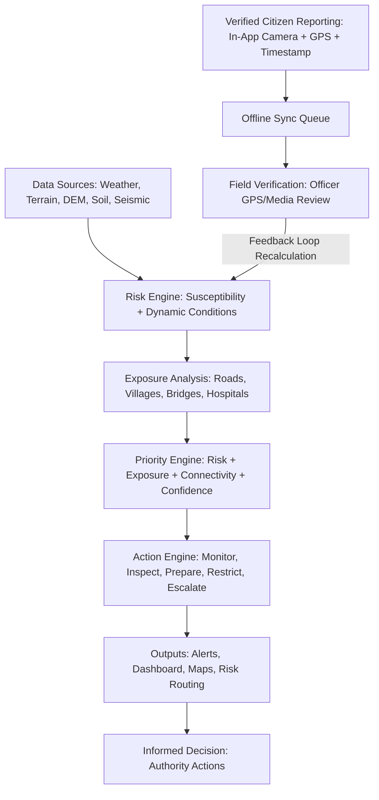

# Implementation Plan - Risk-to-Action Landslide Intelligence Platform

Build a complete, functional Flutter application implementing the **Risk-to-Action Platform Architecture** for landslide risk monitoring, exposure analysis, priority queue management, action dispatching, verified citizen reporting, field verification feedback loop, risk-aware routing, alerts, and regional analytics.

## User Review Required

> [!IMPORTANT]
> - **Flutter SDK Setup**: Flutter 3.27.1 archive is present on the machine (`C:\Users\bably rangpi\Downloads\flutter_windows_3.27.1-stable.zip`). We will extract Flutter to `C:\flutter` or `C:\Users\bably rangpi\flutter_sdk` and set up the project.
> - **Platform & Architecture**: The app will be built with Flutter targeting Web / Windows / Mobile with responsive design for phone, tablet, and desktop dashboards.
> - **End-to-End Functional Pipeline**: Every module from Data Sources → Mock Risk Engine → Exposure Analysis → Priority Engine → Action Engine → Alerts & Dashboards → Citizen Reporting → Field Verification Feedback Loop will be fully functional with reactive state management and realistic North-East India geospatial mock data (Arunachal Pradesh, Assam, Meghalaya, Sikkim, Nagaland).
> - **Clean Extensibility**: Clean interfaces (`RiskEngine`, `BackendClient`, `RiskIntelligenceApi`, `AuthService`, `StorageService`, `OfflineSyncManager`) will isolate the UI from mock implementations so that future AI models (Random Forest / XGBoost / DL) and Supabase / PostGIS REST APIs can be plugged in without changing UI code.

---

## Architecture & Module Breakdown



---

## Proposed Project Structure

```
SIH/
├── pubspec.yaml
├── lib/
│   ├── main.dart
│   ├── app/
│   │   ├── app.dart
│   │   ├── router.dart
│   │   └── theme.dart
│   ├── core/
│   │   ├── constants/
│   │   │   ├── app_colors.dart
│   │   │   ├── app_constants.dart
│   │   │   └── api_endpoints.dart
│   │   ├── models/
│   │   │   ├── risk_data.dart
│   │   │   ├── exposure_asset.dart
│   │   │   ├── priority_item.dart
│   │   │   ├── action_item.dart
│   │   │   ├── alert_model.dart
│   │   │   ├── citizen_report.dart
│   │   │   ├── region_summary.dart
│   │   │   ├── route_model.dart
│   │   │   └── user_profile.dart
│   │   ├── errors/
│   │   └── utils/
│   ├── ai/
│   │   ├── risk_engine.dart               # Core abstract interface
│   │   ├── mock_risk_engine.dart          # Deterministic + reactive feedback mock AI
│   │   └── future_risk_api_engine.dart    # Concrete placeholder for production AI
│   ├── backend/
│   │   ├── backend_client.dart            # Abstraction for Supabase / Custom backend
│   │   ├── mock_backend_client.dart       # In-memory reactive backend
│   │   └── future_supabase_client.dart    # Future Supabase + PostGIS connector
│   ├── data/
│   │   ├── mock/
│   │   │   ├── mock_locations.dart        # NE India dataset (Papum Pare, Tawang, Dima Hasao, etc.)
│   │   │   ├── mock_assets.dart           # Roads, bridges, hospitals, villages
│   │   │   ├── mock_alerts.dart           # Active / Historical warnings
│   │   │   ├── mock_reports.dart          # Citizen & field verification records
│   │   │   └── mock_analytics.dart        # Risk trends, rainfall, incident logs
│   │   ├── repositories/
│   │   │   ├── risk_repository.dart
│   │   │   ├── priority_repository.dart
│   │   │   ├── action_repository.dart
│   │   │   ├── alert_repository.dart
│   │   │   ├── report_repository.dart
│   │   │   └── route_repository.dart
│   │   └── services/
│   │       ├── offline_sync_service.dart
│   │       └── notification_service.dart
│   ├── state/
│   │   ├── app_state.dart                 # Central reactive state orchestrating the pipeline
│   │   └── role_state.dart                # Role-based context (Authority, Field Officer, Citizen)
│   ├── features/
│   │   ├── auth/                          # Role selection & login screen
│   │   ├── dashboard/                     # Main Dashboard with risk metrics, overview, priority list
│   │   ├── risk_map/                      # Interactive map canvas with layers, risk polygons & pins
│   │   ├── risk_details/                  # Risk Assessment breakdown, factors & exposure assets
│   │   ├── priority/                      # Ranked Priority Queue with filtering & direct actions
│   │   ├── actions/                       # Action Engine: status workflow (Pending->In Progress->Done)
│   │   ├── alerts/                        # Alert center with notification channels & severity tabs
│   │   ├── citizen_reporting/             # In-app camera capture, GPS/timestamp lock, submission
│   │   ├── offline_queue/                 # Offline sync queue with online/offline simulation
│   │   ├── field_verification/            # Field officer verification workflow (Verify/Reject/Escalate)
│   │   ├── risk_routing/                  # Risk-aware navigation & route safety comparison
│   │   ├── analytics/                     # Regional trends, charts, risk matrix
│   │   ├── history/                       # Historical timeline & risk shift logs
│   │   └── settings/                      # Role switcher, layer configs, backend schema inspector
│   └── widgets/
│       ├── risk_badge.dart
│       ├── risk_factor_bar.dart
│       ├── priority_card.dart
│       ├── alert_card.dart
│       ├── action_card.dart
│       ├── interactive_map_widget.dart
│       ├── report_card.dart
│       ├── metric_card.dart
│       └── camera_viewfinder.dart
```

---

## Key Features & User Workflows

### 1. Risk-to-Action End-to-End Pipeline
- **Risk Calculation**: Integrates rainfall, slope, DEM, land cover, soil moisture, seismic index, and historical records into a normalized 0–100 Risk Score, Risk Level (`LOW`, `MODERATE`, `HIGH`, `CRITICAL`), and confidence score.
- **Exposure Analysis**: Computes critical infrastructure at risk (NH road corridors, mountain bridges, district hospitals, valley villages, population count).
- **Priority Engine**: Computes dynamic `Priority Score = (Risk * 0.35) + (Exposure * 0.30) + (Connectivity * 0.20) + (Confidence * 0.15)`. Automatically ranks hot-spots.
- **Action Engine**: Generates context-aware recommended actions (`MONITOR`, `INSPECT`, `PREPARE`, `RESTRICT`, `ESCALATE`). Authorities can update statuses (`Pending` → `Assigned` → `In Progress` → `Completed`) with real-time feedback.

### 2. Citizen Reporting & Field Verification Feedback Loop
- **Citizen Report**: Interactive built-in camera simulator capturing GPS coordinates, exact date/timestamp, incident type (Landslide, Crack, Rockfall, Road Blockage, Slope Movement), severity level, and notes.
- **Offline Syncing**: Reports can be saved in offline queue, simulating network disconnects and syncing when connection resumes.
- **Field Verification**: Field officers review pending reports, inspect captured media with GPS coordinates, and can `Verify`, `Reject`, or `Escalate`.
- **Dynamic Feedback Loop**: Verifying a report automatically updates dynamic factor weights in the `RiskEngine`, instantly updating the location's risk score, priority ranking, and triggering alerts across the dashboard!

### 3. Risk-Aware Navigation & Route Planning
- Computes safe vs risky routes between selected origin and destination (e.g., Papum Pare to District Hospital).
- Visualizes Route A (High Risk - Avoid), Route B (Low Risk - Recommended), Route C (Moderate Risk) with distance, time, and road stability.

### 4. Role-Aware Navigation
- **Citizen View**: Focuses on community safety, incident reporting, active local warnings, safe routes, and historical logs.
- **Field Officer View**: Focuses on field tasks, assigned reports, GPS media verification, and on-ground assessments.
- **Authority View**: Full control over risk intelligence, priority queue dispatch, action lifecycle, alert broadcasts, and regional analytics.

---

## Verification Plan

### Automated / Build Verification
- Extract and configure Flutter SDK in environment.
- Run `flutter pub get` and verify dependency resolution.
- Run `flutter analyze` to ensure 0 lint errors and strict null-safety.
- Run `flutter test` for core risk calculations, priority engine formulas, and feedback loop state transitions.

### Functional End-to-End Verification
1. **Login & Role Switch**: Log in as Citizen, Field Officer, and Authority.
2. **Dashboard Overview**: Verify live metric counters, regional status gauge, and priority queue.
3. **Interactive Map**: Select risk zones (Papum Pare, Tawang, etc.), toggle layers (Rainfall, Soil, Landslides), inspect detail sheets.
4. **Action Lifecycle**: Advance actions from `Pending` → `In Progress` → `Completed` and observe dashboard updates.
5. **Report & Feedback Loop Test**:
   - Citizen submits a critical landslide report at Papum Pare.
   - Switch to Field Officer → Verify the report.
   - Verify that Papum Pare's risk score elevates, priority queue re-orders it to #1, and an alert is broadcast.
6. **Risk-Aware Routing**: Verify routing comparison from origin to hospital with recommended low-risk path.
7. **Offline Queue**: Add reports in offline mode, toggle network online, click Sync Now.
